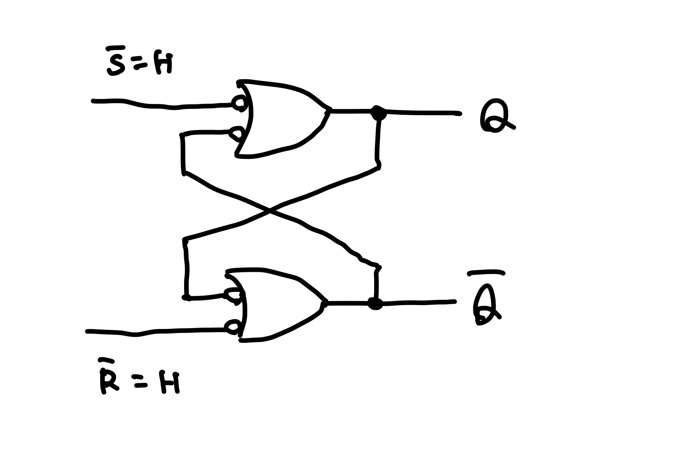

# ラッチ
フリップフロップの一種で、Texas Instruments社の規格表ではクロックが変化した時に状態および出力が変化するものを**フリップフロップ**（FF）と呼び、そうでないものを**ラッチ**と呼ぶ。

## $\bar{\text{S}}\bar{\text{R}}$ラッチ

NOTゲートを2つ組み合わせることでデータ（Q）を保持できる。
もし`Q = H`になれば、ずっとそれを維持できる（= データを記憶できる）し、強制的に電圧を落として`Q = L`にしても同様。
この回路を制御するために、外部から強制的にセット状態・リセット状態に設定するための入力を付けたのが $\bar{\text{S}}\bar{\text{R}}$ ラッチ。

ここで、セットとリセット両方にHを入力したとき、先ほどの回路に帰着する。
`S = L`にすると強制的に`Q = H`となり、セット状態になる。また、`R = L`にすると強制的に`Q = L`となり、リセット状態になる。
セットとリセット両方にLを入力したとき、 $Q$ も $\bar{Q}$ もHになってしまうため、**禁止状態**と呼ばれる。単にデータの保持という元の目的に照らせばありえない状態だというだけで、使うこと自体が禁止されているわけではない。

## Dラッチ

