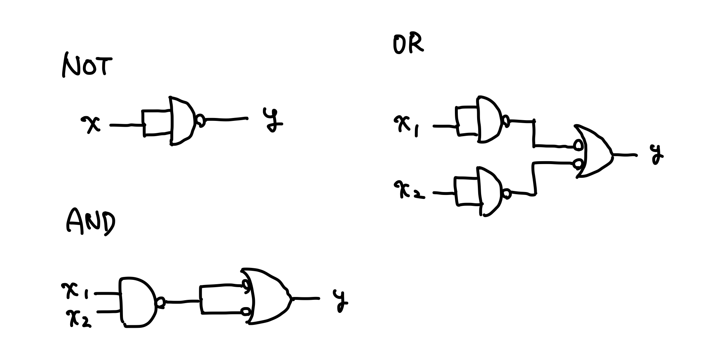

# 万能ゲート

あらゆる組み合わせ回路を構成可能な論理ゲートの組を**万能な論理ゲート**、**万能ゲート**（Universal logic gates）と呼ぶ。

## 万能ゲートの例

[主加法標準形](./sop.md)であったように、加法標準形設計手法であらゆる組み合わせ回路を構成できるので、`{AND, OR, NOT}`は万能ゲート。
また、$x_1 \lor x_2 = \lnot (\lnot x_1 \land \lnot x_2)$より、`{AND, NOT}`も万能ゲート。
さらに、NANDやNORからAND、OR、NOTを構成することができるので、`{NAND}`と`{NOR}`も万能ゲート。たとえば[nand2tetris](https://www.nand2tetris.org/)が実現できるのは、NANDが万能ゲートであるから。

## NANDからAND、OR、NOTを導出する

ある回路を構成するゲートの最小個数を求める問題はNP困難（回路最小化問題）。
小さい回路の場合には全探索やパターンマッチによって事前に最小のゲート数を求めることができるが、`n`入力のブール関数で最小個数を求めることはできず、SATソルバーのようにヒューリスティックに求めるしかない。
[回路最小化問題は最悪時間計算量と平均時間計算量がほぼ同じ](https://seeds.nii.ac.jp/seeds/2022-hirahara#:~:text=%E7%A7%81%E3%81%AF%E5%9B%9E%E8%B7%AF%E6%9C%80%E5%B0%8F%E5%8C%96%E5%95%8F%E9%A1%8C%E3%81%A8%E5%91%BC%E3%81%B0%E3%82%8C%E3%82%8B%E3%80%81%E5%85%A5%E5%8A%9B%E3%81%A8%E3%81%97%E3%81%A6%E4%B8%8E%E3%81%88%E3%82%89%E3%82%8C%E3%81%9F%E3%83%96%E3%83%BC%E3%83%AB%E5%80%A4%E9%96%A2%E6%95%B0%E3%82%92%E8%A8%88%E7%AE%97%E3%81%99%E3%82%8B%E3%82%88%E3%81%86%E3%81%AA%E5%B0%8F%E3%81%95%E3%81%84%E8%AB%96%E7%90%86%E5%9B%9E%E8%B7%AF%E3%82%92%E6%B1%82%E3%82%81%E3%82%8B%E5%95%8F%E9%A1%8C%EF%BC%88%E5%9B%B3%EF%BC%89%E3%81%AB%E3%81%A4%E3%81%84%E3%81%A6%E3%80%81%E6%9C%80%E6%82%AA%E6%99%82%E8%A8%88%E7%AE%97%E9%87%8F%E3%81%A8%E5%B9%B3%E5%9D%87%E6%99%82%E8%A8%88%E7%AE%97%E9%87%8F%E3%81%8C%E3%81%BB%E3%81%A8%E3%82%93%E3%81%A9%E5%90%8C%E3%81%98%E3%81%A7%E3%81%82%E3%82%8B%E3%81%93%E3%81%A8%E3%82%92%E7%A4%BA%E3%81%97%E3%81%BE%E3%81%97%E3%81%9F%E3%80%82)。
